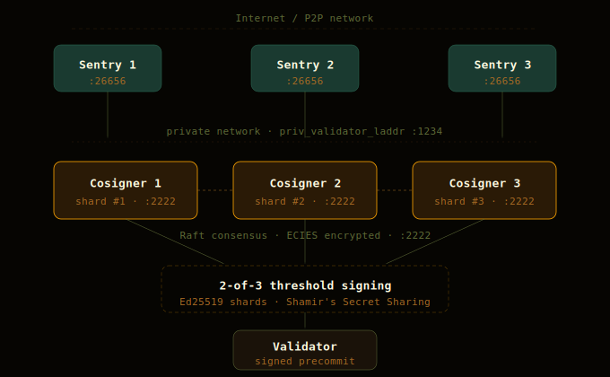

# cumulo-horcrux

Horcrux threshold signing architecture, deployment guides, and Grafana metrics dashboard for Cumulo's CometBFT validators.

<div align="center">
  
</div>

## What is Horcrux?

Horcrux is a multi-party-computation (MPC) signing service for CometBFT nodes. It enhances security and availability by distributing the validator private key among multiple cosigner nodes using Shamir's Secret Sharing, thereby preventing double signing and eliminating single points of failure. The project uses Raft for leader election and consensus among cosigners.

Cumulo runs a **2-of-3 threshold signing** setup across three independent cosigner nodes on separate providers, signing multiple chains from a single Horcrux cluster.

+info https://github.com/strangelove-ventures/horcrux


---

## Documentation

[→ Installation and Usage Guide](docs/installation-guide.md)

[→ Modify an existing Horcrux architecture](docs/modify-architecture.md)

[→ Adding a chain to an existing multi-chain setup](docs/add-chain-multichain.md)

[→ Useful Commands](docs/useful-commands.md)

[→ Metrics with Grafana & Prometheus](docs/metrics-grafana-prometheus.md)

[→ Dashboard Metrics Reference](docs/metrics-dashboard.md)

---

## Repository structure

```
cumulo-horcrux/
├── README.md
├── docs/
│   ├── installation-guide.md
│   ├── modify-architecture.md
│   ├── add-chain-multichain.md
│   ├── useful-commands.md
│   ├── metrics-grafana-prometheus.md
│   └── metrics-dashboard.md
└── grafana/
    └── cumulo-horcrux-dashboard.json
```

---

## Grafana dashboard

The Cumulo Horcrux Monitoring dashboard is available in [`grafana/cumulo-horcrux-dashboard.json`](grafana/cumulo-horcrux-dashboard.json).

It uses a job-based variable to select which cosigner cluster to monitor, and displays metrics per chain automatically — no changes needed when adding or removing chains. See [Metrics with Grafana & Prometheus](docs/metrics-grafana-prometheus.md) for setup instructions.

---

## Cumulo.Pro

[cumulo.pro](https://cumulo.pro) · Stake with us.
